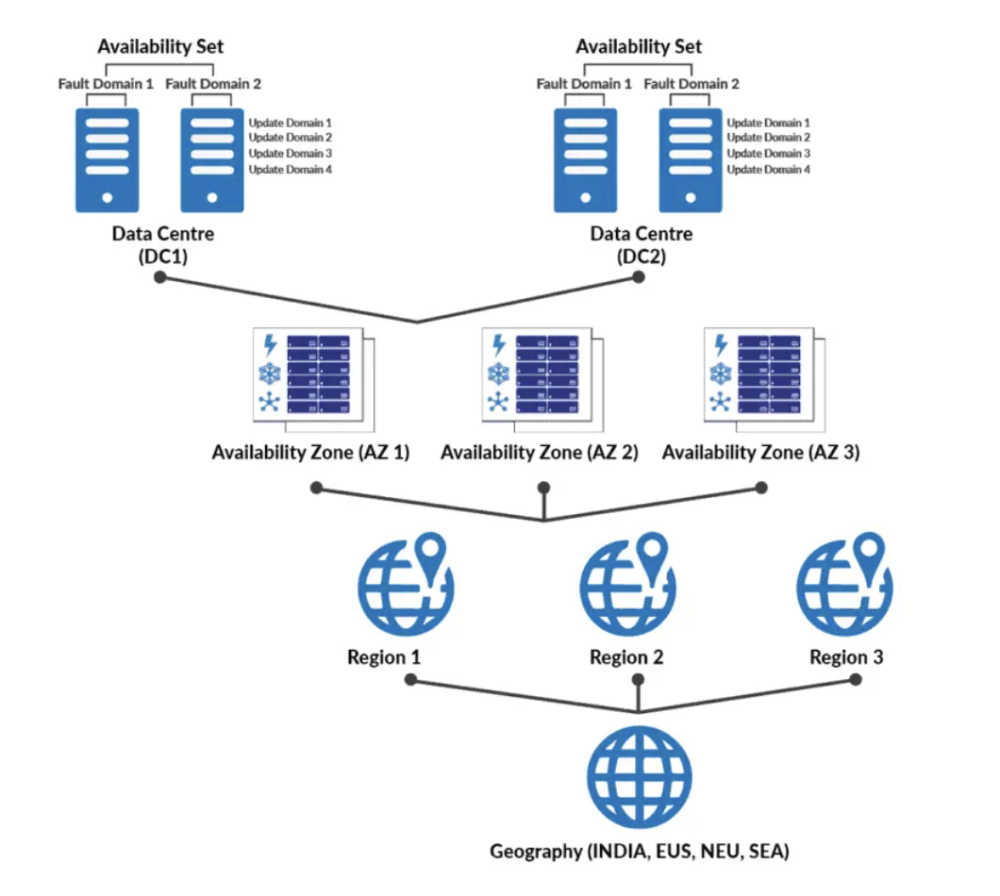
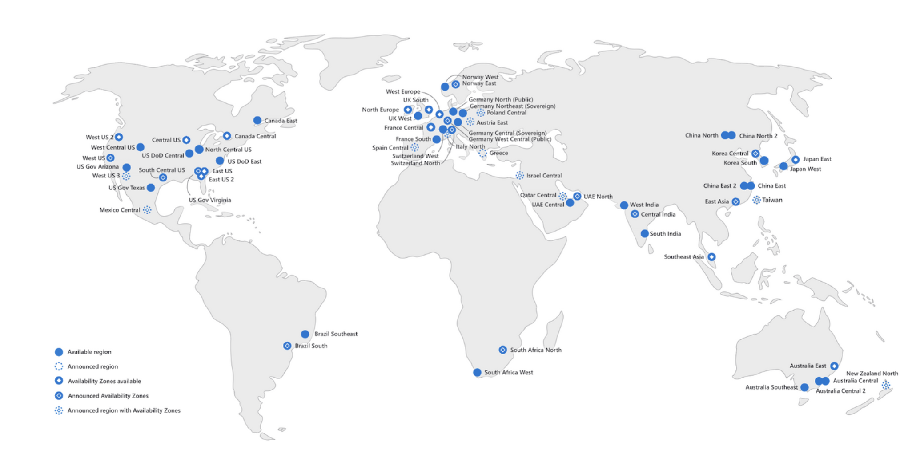
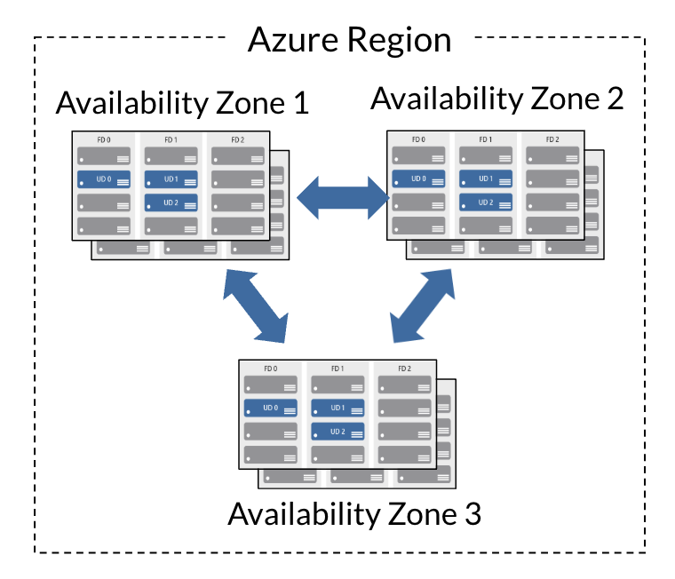
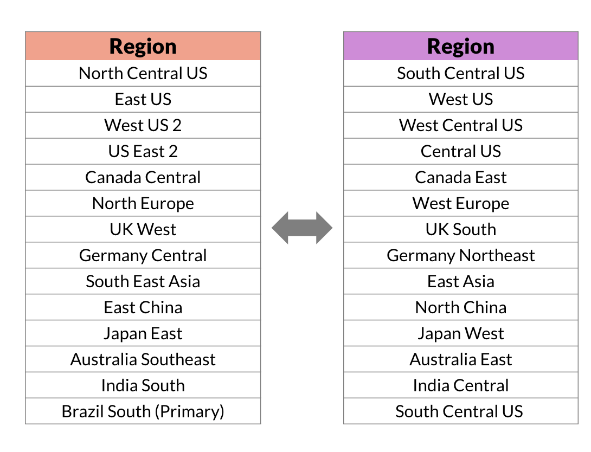
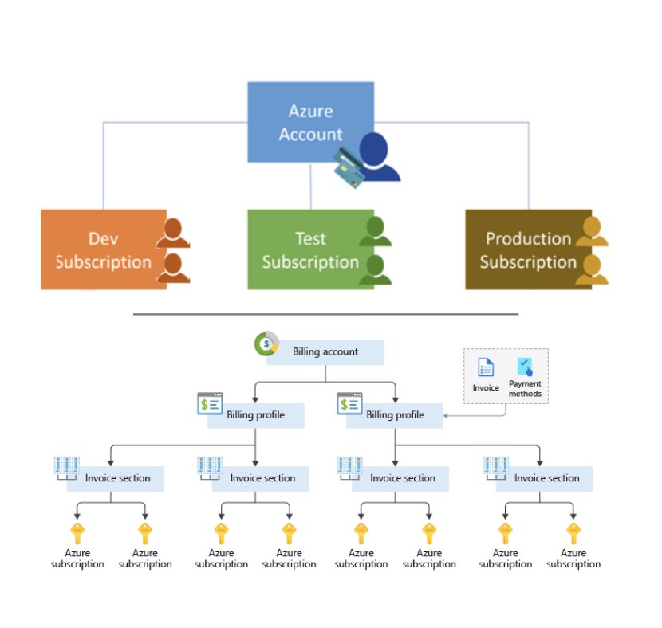
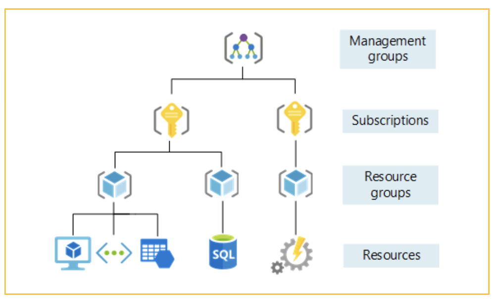

# Lesson: Introduction to Azure Cloud Computing

### Overview

This lesson provides a comprehensive exploration of Azure Cloud Computing, delving into its foundational architectural elements and the Shared Responsibility Model. By examining Azure's regions, availability zones, region pairs, subscriptions, resource groups, and management groups, learners will gain a profound understanding of how Azure delivers unparalleled reliability, scalability, and governance for cloud-based solutions. This foundational knowledge is essential for leveraging Azure’s features in designing resilient and efficient cloud infrastructures.

### Learning Objectives

By the end of this lesson, you will be able to:

1. Analyze the Shared Responsibility Model as applied in Azure Cloud.
2. Articulate the roles and functionalities of Azure’s architectural components, including regions, availability zones, and region pairs.
3. Differentiate the concepts of subscriptions, resource groups, and management groups, including their hierarchical relationships and best practices.
4. Evaluate the implications of Azure’s architecture in crafting resilient, scalable, and compliant cloud infrastructures.

### Introduction to Azure Cloud

Microsoft Azure is a cloud computing platform with an ever-expanding set of services to help you build solutions to meet your business goals. Azure services support everything from simple to complex. 

Azure has simple web services for hosting your business presence in the cloud. 

Azure also supports running fully virtualized computers managing your custom software solutions. Azure provides a wealth of cloud-based services like remote storage, database hosting, and centralized account management. 

Azure also offers new capabilities like artificial intelligence (AI) and Internet of Things (IoT) focused services.

### Shared Responsibility Model

The Shared Responsibility Model outlines the distinct allocation of duties between Microsoft, as the cloud provider, and its customers. This framework ensures clarity in governance, security, and operational management, fostering a shared commitment to achieving robust, secure, and efficient cloud operations.

#### Responsibilities Across Service Models

The division of responsibilities varies significantly across On-Premises, IaaS, PaaS, and SaaS models. The table below illustrates this distinction:

| Responsibility             | On-Premises        | IaaS                   | PaaS                   | SaaS                   |
|--------------------------------|------------------------|----------------------------|----------------------------|----------------------------|
| Data Access and Security   | Customer               | Customer                   | Customer                   | Customer                   |
| Applications               | Customer               | Customer                   | Shared                     | Microsoft                  |
| Runtime                    | Customer               | Customer                   | Microsoft                  | Microsoft                  |
| Operating System (OS)      | Customer               | Customer                   | Microsoft                  | Microsoft                  |
| Virtual Machines (VMs)     | Customer               | Microsoft                  | Microsoft                  | Microsoft                  |
| Compute Resources          | Customer               | Microsoft                  | Microsoft                  | Microsoft                  |
| Networking                 | Customer               | Microsoft                  | Microsoft                  | Microsoft                  |
| Storage                    | Customer               | Microsoft                  | Microsoft                  | Microsoft                  |

#### Details of Responsibilities

- Microsoft’s Responsibilities:
  - Ensuring robust physical infrastructure including data centers, servers, and networking equipment.
  - Delivering compliance management and attaining certifications adhering to global standards.
  - Maintaining service availability through redundancy, disaster recovery, and 24/7 monitoring.

- Customer’s Responsibilities:
  - Implementing data access controls and safeguarding sensitive information.
  - Configuring identity and access management systems to secure user authentication and authorization.
  - Managing application-level security and ensuring runtime stability for custom applications.

### Azure Architectural Components

Azure’s architecture is designed to deliver unparalleled high availability, resilience, and global scalability. It encompasses regions, availability zones, and region pairs that form the backbone of Azure’s services.

#### Regions

Azure regions are strategically placed geographic areas hosting one or more interconnected data centers.

- Examples: East US, West Europe, Southeast Asia.
- Purpose: Facilitates resource deployment closer to end-users to minimize latency.
- Use Cases: Optimizing latency, ensuring compliance, and implementing disaster recovery strategies.

#### Availability Zones

Availability Zones are discrete, physically separated locations within an Azure region. Each zone is designed to operate independently, with dedicated power, cooling, and networking to ensure fault tolerance.

- Purpose: Minimizes the risk of data center failures impacting critical applications.
- Use Cases: Hosting mission-critical applications and databases requiring high availability and redundancy.

#### Region Pairs

Region pairs are strategically paired Azure regions within the same geography to ensure disaster recovery and redundancy.

- Characteristics:
  - Physical separation to minimize correlated failures.
  - Prioritized recovery for paired regions during widespread outages.
- Examples: East US paired with West US, North Europe paired with West Europe.
- Use Cases: Leveraging cross-region replication and disaster recovery for enhanced business continuity.

### Subscriptions

Subscriptions in Azure establish logical boundaries for managing resources, billing, and tracking usage.

- Characteristics:
  - Unique billing relationships with Azure.
  - Associated with an Azure Active Directory (AAD) tenant for seamless access and management.
- Use Cases: Segmenting resources by organizational teams, individual projects, or distinct environments (e.g., development, staging, production).

### Resource Groups

Resource groups are logical containers that organize Azure resources based on shared lifecycles, ownership, or management requirements.

- Features:
  - Facilitate unified lifecycle management of resources.
  - Simplify cost tracking and access controls.
- Best Practices:
  - Group resources with shared lifecycles to simplify management.
  - Employ descriptive naming conventions to enhance clarity and accountability.

### Management Groups

Management Groups provide hierarchical organization for Azure subscriptions, enabling centralized governance and policy enforcement.

- Features:
  - Apply cost control measures and governance policies across multiple subscriptions.
  - Support enterprise-scale resource organization.
- Hierarchy Example:
  - Root Management Group > IT Department > Development Subscriptions.
- Use Cases: Ensuring consistent compliance and governance across multiple subscriptions in large organizations.

### Benefits of Azure’s Architecture

1. High Availability: Ensures fault tolerance through availability zones and region pairs.
2. Global Presence: Offers extensive reach for reduced latency and adherence to regional compliance requirements.
3. Scalability: Provides dynamic scaling to meet fluctuating workload demands effectively.
4. Governance and Control: Enhances operational transparency with Management Groups and resource groups.
5. Resilience: Incorporates built-in disaster recovery mechanisms for uninterrupted operations.

### Conclusion

Azure’s robust architecture—encompassing regions, availability zones, region pairs, subscriptions, resource groups, and management groups—empowers organizations to design resilient, scalable, and efficient cloud solutions. By understanding and leveraging these architectural components, businesses can achieve operational excellence, meet compliance requirements, and drive innovation with confidence.

### Suggested Reading

1. [Azure Regions Documentation](https://learn.microsoft.com/en-us/azure/availability-zones/az-overview)
2. [Shared Responsibility Model](https://learn.microsoft.com/en-us/azure/security/fundamentals/shared-responsibility)
3. [Azure Management Groups Overview](https://learn.microsoft.com/en-us/azure/governance/management-groups/overview)
4. [Azure Resource Groups](https://learn.microsoft.com/en-us/azure/azure-resource-manager/management/manage-resource-groups-portal)

### YouTube Links

1. [Azure Tutorials](https://www.youtube.com/watch?v=kg4tV1HOfns&ab_channel=in28minutes)
