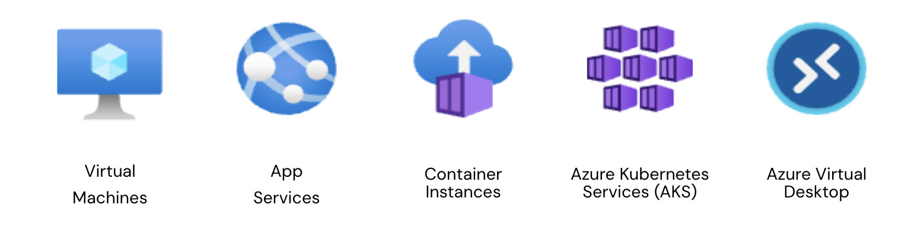
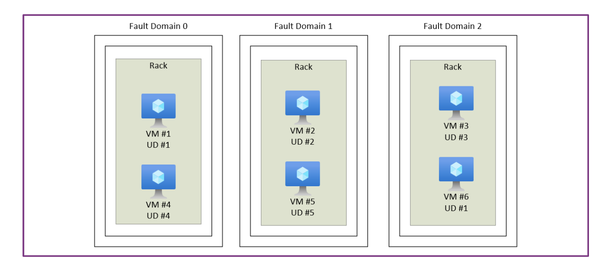

# Lesson: Azure Compute Services

#### Overview

Azure Compute Services provide the backbone for running applications, hosting services, and managing virtualized workloads in the cloud. From traditional virtual machines to advanced container orchestration and desktop virtualization, Azure offers a broad range of compute options to meet diverse business needs.

### Learning Objectives

By the end of this lesson, you will be able to:
1. Understand the features and use cases of Azure Virtual Machines, VM Scale Sets, and VM Availability Sets.
2. Learn how Azure App Services simplify the deployment of web applications.
3. Explore Azure Container Instances for lightweight containerized applications.
4. Understand Azure Kubernetes Service (AKS) for orchestrating large-scale containerized applications.
5. Learn how Azure Virtual Desktop enables secure desktop virtualization in the cloud.

### Azure Virtual Machines (VMs)

Azure Virtual Machines provide scalable, on-demand computing resources, allowing you to deploy and run applications without managing physical hardware.

#### Key Features
- Customizable Infrastructure: Choose operating systems, storage options, and network configurations.
- Scalability: Adjust resources to meet workload demands.
- Security: Integrated with Azure Active Directory and network security options.
- Wide OS Support: Includes Linux, Windows, and third-party operating systems.

#### Use Cases
- Running traditional applications requiring full control over the operating system.
- Hosting development and testing environments.
- Deploying legacy workloads that need specific configurations.

### VM Scale Sets

Azure VM Scale Sets allow you to create and manage groups of identical, load-balanced virtual machines. They are designed to support high-availability applications by scaling the number of VMs based on demand.

#### Key Features
- Automatic Scaling: Add or remove VMs based on CPU, memory, or custom metrics.
- Load Balancing: Distribute traffic evenly across VMs.
- Cost-Effective: Pay only for the resources you use.

#### Use Cases
- Hosting large-scale web applications.
- Running big data and high-performance computing workloads.
- Building elastic application backends.

### VM Availability Sets

Azure VM Availability Sets ensure high availability for applications by distributing VMs across multiple fault and update domains.

#### Key Features
- Fault Domains: Ensure VMs are on different physical hardware.
- Update Domains: Allow rolling updates without downtime.
- 99.95% SLA: Ensures minimal disruptions.

#### Use Cases
- Ensuring resilience for mission-critical applications.
- Protecting workloads from planned and unplanned maintenance events.

### Azure App Services

Azure App Services is a fully managed platform for building, deploying, and scaling web apps and APIs.

#### Key Features
- Multi-Language Support: Includes .NET, Java, PHP, Node.js, Python, and Ruby.
- Autoscaling: Automatically adjusts resources based on demand.
- Integration: Easily integrates with Azure DevOps, GitHub, and CI/CD pipelines.
- Built-In Security: Includes authentication, SSL/TLS, and compliance certifications.

#### Use Cases
- Hosting business-critical web applications.
- Running RESTful APIs for mobile and web clients.
- Deploying serverless web apps with minimal management.

### Azure Container Instances (ACI)

Azure Container Instances enable you to run containers without managing the underlying infrastructure.

#### Key Features
- Fast Deployment: Run containers in seconds without complex setup.
- Serverless Containers: Pay only for the resources you consume.
- Isolation: Containers run in a secure environment with no host dependencies.

#### Use Cases
- Running simple containerized applications or microservices.
- Hosting development and testing environments.
- Quickly running jobs or scheduled tasks.

### Azure Kubernetes Service (AKS)

Azure Kubernetes Service simplifies deploying, managing, and scaling containerized applications using Kubernetes.

#### Key Features
- Orchestration: Automates deployment, scaling, and management of containerized applications.
- Integrated Monitoring: Includes Azure Monitor and Log Analytics for observability.
- CI/CD Integration: Streamlines workflows with Azure DevOps and GitHub Actions.
- Hybrid Deployments: Extend AKS workloads to on-premises environments with Azure Arc.

#### Use Cases
- Running enterprise-grade microservices architectures.
- Supporting high-availability applications requiring load balancing and scaling.
- Simplifying multi-container orchestration for DevOps workflows.

### Azure Virtual Desktop (AVD)

Azure Virtual Desktop provides a secure and scalable way to deliver virtualized desktops and applications.

#### Key Features
- Multi-Session Windows: Supports multiple users on the same Windows instance.
- Flexibility: Use personal desktops or pooled desktops based on requirements.
- Integration: Works seamlessly with Microsoft 365 and Azure Active Directory.
- Security: Built-in support for data protection, conditional access, and compliance.

#### Use Cases
- Enabling remote work with secure access to corporate resources.
- Supporting temporary workers or contractors with virtual desktops.
- Running legacy applications in a modern, secure environment.

### Comparison of Azure Compute Services

| Service             | Best For                                   | Key Strength                       | Example Use Cases                                |
|--------------------------|-----------------------------------------------|-----------------------------------------|-----------------------------------------------------|
| Azure VMs               | General-purpose compute                      | Full control over OS and apps           | Hosting legacy applications, testing environments   |
| VM Scale Sets           | High-availability applications               | Elastic scaling and load balancing      | Large-scale web or database applications            |
| VM Availability Sets    | Resilience for critical applications         | Fault tolerance and rolling updates     | Protecting workloads from hardware failures         |
| Azure App Services      | Web apps and APIs                            | Fully managed platform                  | E-commerce sites, mobile app backends               |
| Azure Container Instances | Lightweight containerized apps             | Quick deployment without infrastructure | Batch processing, small-scale microservices         |
| Azure Kubernetes Service | Large-scale containerized applications      | Full container orchestration            | Enterprise microservices, cloud-native apps         |
| Azure Virtual Desktop   | Virtual desktops for remote work             | Secure and scalable desktop delivery    | Enabling remote teams, running legacy applications  |

### Benefits of Azure Compute Services

1. Flexibility: A wide range of options to suit diverse workloads.
2. Scalability: Automatically adjust resources to meet demand.
3. Cost-Effective: Pay for what you use with options to optimize costs.
4. Security: Built-in tools for compliance, encryption, and identity management.
5. Integration: Works seamlessly with other Azure services.

### Suggested Reading

1. [Azure Virtual Machines](https://learn.microsoft.com/en-us/azure/virtual-machines/)
2. [VM Scale Sets](https://learn.microsoft.com/en-us/azure/virtual-machine-scale-sets/)
3. [Azure Kubernetes Service](https://learn.microsoft.com/en-us/azure/aks/)
4. [Azure App Services](https://learn.microsoft.com/en-us/azure/app-service/)

### YouTube links

1. [Azure Compute](https://www.youtube.com/watch?v=inaXkN2UrFE&ab_channel=AdamMarczak-AzureforEveryone)