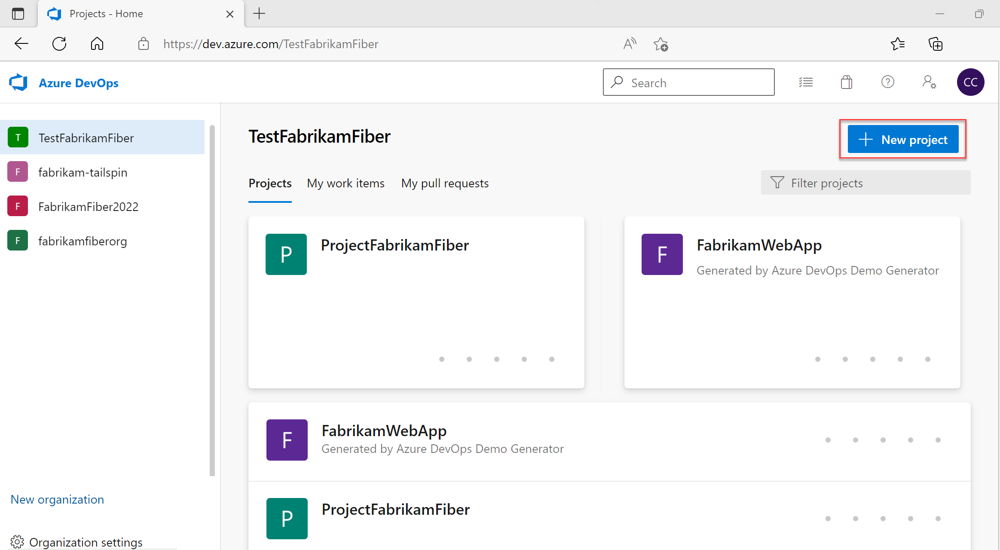
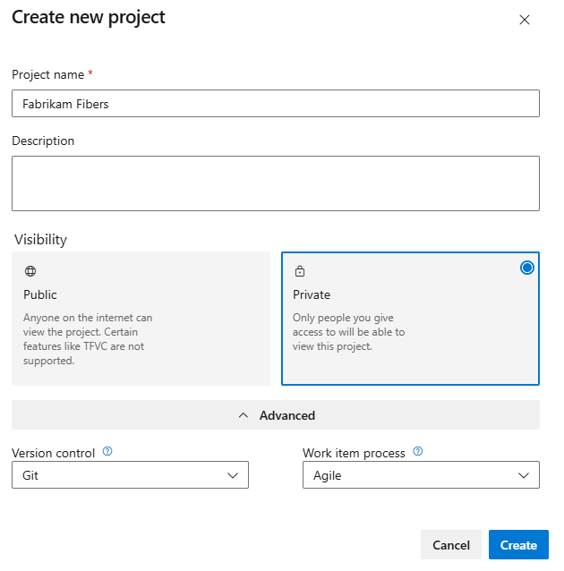
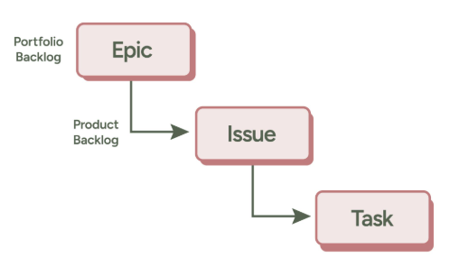
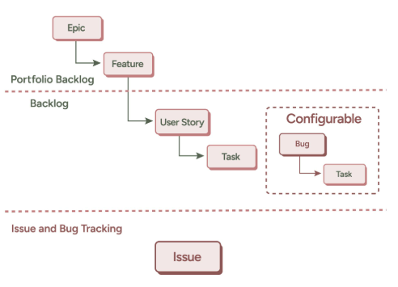
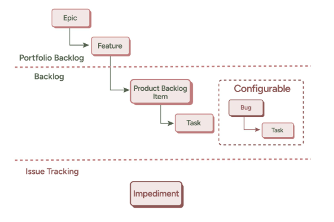

# Introduction to Azure Organization and Project

## Overview

An Azure DevOps organization is a tool for organizing and joining related projects. 

An Azure DevOps organization can be company-wide, or it can be for specific business units in your company.


## Lesson Outcomes

By the end of this lesson, you will be able to:

1. Understand what is a Azure Orgnization and Azure Projects
2. Understand the key features of Orgnization and Azure Projects
3. Understand how to create Organization and project to start with Azure Devops

## Azure Organization

Azure DevOps organizations give you access to the Azure DevOps toolchain, where you can perform the following:

➤ Schedule and track your tasks and issues with Azure Boards

➤ Work with software developers to build applications with source control management tools like Azure Repos

➤ Set up continuous integration and deployment with Azure Pipelines

➤ Create, organize, and share packages with Azure Artifacts

➤ Test applications end to end using Azure Test Plans

It also represents the top-level structure where you manage your teams, users, permissions, and billing.

**Key Features:**
1. **Unique URL:** Each organization has a unique URL, such as https://dev.azure.com/{organization-name}.
2. **User Management:** Add and manage users who can collaborate on projects.
3. **Settings:** Configure policies, pipelines, and resource limits at the organizational level.
4. **Billing:** Billing for Azure DevOps is managed at the organization level.

## Azure Project

A project is a store for data in Azure DevOps. Each organization can have many projects. Projects can contain the following:

➤ Boards and backlogs for project planning using the agile or scrum methodology

➤ Code build and release pipelines for continuous integration and deployment

➤ Code repositories for version control and management of source code

➤ Repositories for built and sharable artifacts

➤ Continuous test plans for the entire project life cycle

## Relationship Between Organization and Project

Organizations are the umbrella structure containing one or more projects.
A single organization can host multiple projects, and you can manage permissions and resources separately for each project.

Visual Representation:
```yaml
Organization: Contoso
  ├── Project: Web App Development
  │     ├── Repositories
  │     ├── Pipelines
  │     ├── Boards
  ├── Project: Mobile App Development
        ├── Repositories
        ├── Pipelines
        ├── Boards
```


## Creating an Azure DevOps Organisation

### Prerequisites

- Microsoft Account: Ensure you have a Microsoft account.

- Azure Subscription/Free Tier: Not mandatory for basic setup, but required if you want to integrate with Azure resources.

### Steps
1. Sign in to [Azure Devops](https://azure.microsoft.com/en-us/products/devops/)
2. After signing in, click on the "New Organization" button.
    - **Organization Name:**
        This is the unique name for your organization.
        Example: DemoDevops
    - **Region**:
        Select a region closest to your users to ensure better performance.
        Example: East US, West Europe, etc.

~~~
📒 Note: 

Adhere to the following guidelines when you create an organization name.
 - Use only letters from the English alphabet
 - Start your organization name with a letter or number
 - Use letters, numbers, or hyphens after the initial character
 - Ensure that your organization doesn't exceed 50 Unicode characters
 - End with a letter or number
~~~

### *Congratulations, you're an organization owner!*

Sign in to your organization at any time, https://dev.azure.com/{yourorganization}.

With your organization, the following aspects are included in the free tier:

- First five users free (Basic license)
- Azure Pipelines:
- One Microsoft-hosted CI/CD (one concurrent job, up to 30 hours per month)
- One self-hosted CI/CD concurrent job
- Azure Boards: Work item tracking and boards
- Azure Repos: Unlimited private Git repos
- Azure Artifacts: Two GiB free per organization


## How to Create an Azure Project

### Prerequisites

- Azure DevOps Organization: You must already have an Azure DevOps organization. If not, follow the steps to create an Azure DevOps organization.
- Access to Organization: Ensure you have the necessary permissions to create a project (Project Collection Administrator role is required).

### Steps
1. Login to [Azure Devops](https://azure.microsoft.com/en-us/products/devops/)

2. Select your organization from the dropdown menu or enter its URL

3. Select New project.



4. Enter information into the form provided.



5. Select Create. Azure DevOps displays the project welcome page.

### _Congratulations, you have create a project!_

### Understanding Project Processes

When your team initiates an Azure DevOps project, the team has to determine which process and templates to use. Processes and templates define the basic details of the work item tracking system used by Azure Boards. Azure DevOps supports the following processes:

➤ Basic: This is the most straightforward process that teams can choose. Track your work using epics, issues, and tasks. You can use this model when creating a new default project, as shown below



➤ Agile: Choose Agile if your team uses an agile planning process. You can track different work items, such as features, user stories, and tasks. Agile also uses a kanban board to track user stories and bugs. You can also manage them on the task board. You can use this model when you select the Agile process type as you create your project.



➤ Scrum: If your team uses the Scrum methodology, you choose the Scrum process. You can generate product backlog items (PBIs), tasks, bugs, and other work items for your team by leveraging the scrum process. You can also use kanban boards to track artifacts or break down PBIs and errors into tasks on task boards. 




## Suggested Reading
[Azure Project Documentation](https://learn.microsoft.com/en-us/azure/devops/organizations/projects/create-project?view=azure-devops&tabs=browser)

[Azure Organization Documentation](https://learn.microsoft.com/en-us/azure/devops/organizations/accounts/create-organization?view=azure-devops)

Image source - Microsoft Documentation