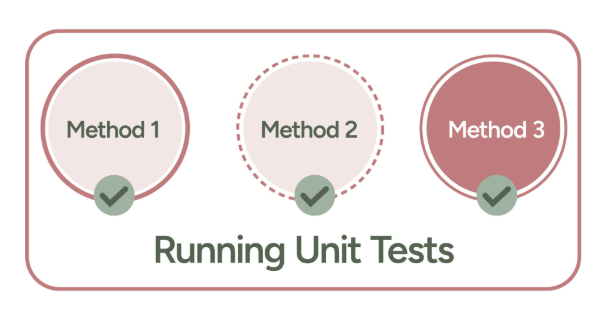
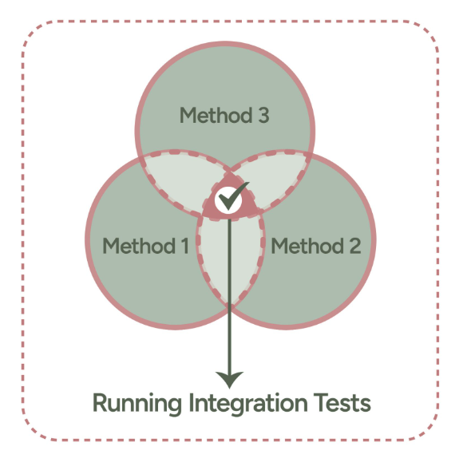
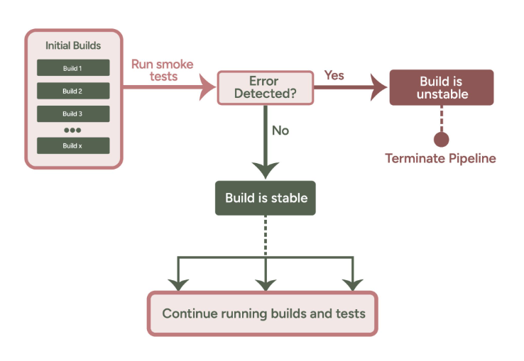

# Automated Testing in Deployment Pipelines

## Overview

Automated testing is a key component of modern software development and deployment pipelines. It ensures that applications are functional, secure, and performant while significantly reducing manual effort. This lesson focuses on integrating automated testing into Continuous Integration and Continuous Deployment (CI/CD) workflows, particularly in Azure Pipelines.

## Learning Objectives

By the end of this lesson, you will be able to:

1. Understand the importance of automated testing in CI/CD pipelines.
2. Describe the benefits of continuous testing.
3. Identify various types of software tests and their use cases.
4. Implement automated testing in Azure Pipelines with practical examples.


## Introduction to Automated Testing in CI/CD Pipelines

Automated testing evaluates software for functionality, performance, and security as part of the CI/CD process. By running tests automatically at different stages of development, teams can detect and fix issues early, improving overall software quality and reducing deployment risks.

### Importance of Automated Testing
1. **Early Bug Detection:** Identifies issues early in the development cycle, minimizing costs and delays.
2. **Consistent Quality:** Maintains consistent application quality across releases.
3. **Faster Releases:** Speeds up delivery by automating repetitive tasks.
4. **Reduced Human Error:** Replaces manual testing with automated, repeatable processes.


## Continuous Testing

### Traditional vs. Continuous Testing
In traditional workflows, testing occurs late in the development lifecycle, often leading to rushed fixes and delayed releases. Continuous testing integrates testing throughout the development lifecycle, running tests simultaneously as code is written.

### Benefits of Continuous Testing
1. **Faster Feedback Loop:** Developers get immediate feedback, enabling quicker fixes.
2. **Reduced Costs:** Fixing bugs earlier is cheaper and less disruptive.
3. **Improved Risk Management:** Testing alongside development helps mitigate risks early.


## Types of Software Tests

### Unit Tests
Unit tests validate individual components of the application in isolation.



**Key Features:**
- Validates small code units with multiple scenarios.
- Encourages modular and testable code.
- Allows testing of completed modules without waiting for the entire feature.

**Example:**
```java
@Test
public void testAddition() {
    assertEquals(5, Calculator.add(2, 3));
}
```


### Integration Tests
After running unit tests, the next level of tests in an application are called integration tests. In this phase, software units are integrated and tested together. The reason for this is to expose flaws during the interaction between the integrated software components. In isolation, software components might work as they should, but bringing them together might introduce new kinds of problems the software
developers need to fix before shipping the application



**Key Features:**
- Identifies issues in component interactions.
- Ensures that integrated systems function as expected.

**Example:**
Testing a user registration system by integrating the database and authentication services.


### Smoke Tests
Smoke tests are used to verify that all the important application features are working as intended. This is often an indication of whether or not the build after a code change is stable. If the build is stable, then the application can be checked into source control so that further testing and planned releases can occur. Beyond code reviews on pull requests, smoke testing is another cost-effective technique for finding and fixing software bugs. 



**Key Features:**
- Ensures the stability of a build after code changes.
- Validates that essential features are functional.

**Example:** Running a quick test to ensure a login page is operational before proceeding with detailed testing.


### Regression Tests
Regression tests confirm that new changes do not break existing functionality.

**Key Features:**
- Reruns previous tests to validate that the application remains stable.
- Detects unintended side effects of code modifications.

**Example:** Testing the checkout process in an e-commerce application after adding a new payment method.


### Other Types of Tests
1. **Acceptance Tests:** Verifies that the application meets user requirements.
2. **Security Tests:** Ensures the application is resilient to threats like hacking or malware.
3. **Performance Tests:** Assesses the application's responsiveness, speed, and scalability under load.


## Automated Testing in Azure Pipelines

Azure Pipelines supports integrating automated tests into your CI/CD workflows. It allows you to define test stages and tasks to ensure code quality before deployment.

### Example: Configuring Automated Tests in Azure Pipelines

**Pipeline YAML Configuration:**
```yaml
trigger:
  branches:
    include:
      - main

stages:
  - stage: Build
    jobs:
      - job: BuildJob
        steps:
          - script: mvn clean install
            displayName: 'Build the application'

  - stage: Test
    dependsOn: Build
    jobs:
      - job: TestJob
        steps:
          - script: mvn test
            displayName: 'Run Unit Tests'
```


## Benefits of Automated Testing in Azure Pipelines
1. **Integration with CI/CD:** Automates testing in every phase of the development pipeline.
2. **Customizable Workflows:** Supports various test frameworks and tools.
3. **Scalability:** Executes tests across multiple environments and configurations.


## Best Practices for Automated Testing

1. **Test Early and Often:** Implement testing at every stage of development.
2. **Use Version Control:** Keep test scripts and configurations in version control.
3. **Focus on Critical Paths:** Prioritize testing critical features and components.
4. **Automate Regression Tests:** Ensure that new changes do not introduce issues.
5. **Monitor Test Results:** Analyze logs and metrics for insights into failures.


## Suggested Reading and Resources
1. [Azure DevOps Documentation on Testing](https://learn.microsoft.com/en-us/azure/devops/pipelines/test/)
2. [JUnit Documentation](https://junit.org/junit5/)
3. [Mocha Testing Framework](https://mochajs.org/)
4. [Azure Pipelines YAML Schema](https://learn.microsoft.com/en-us/azure/devops/pipelines/yaml-schema/)


