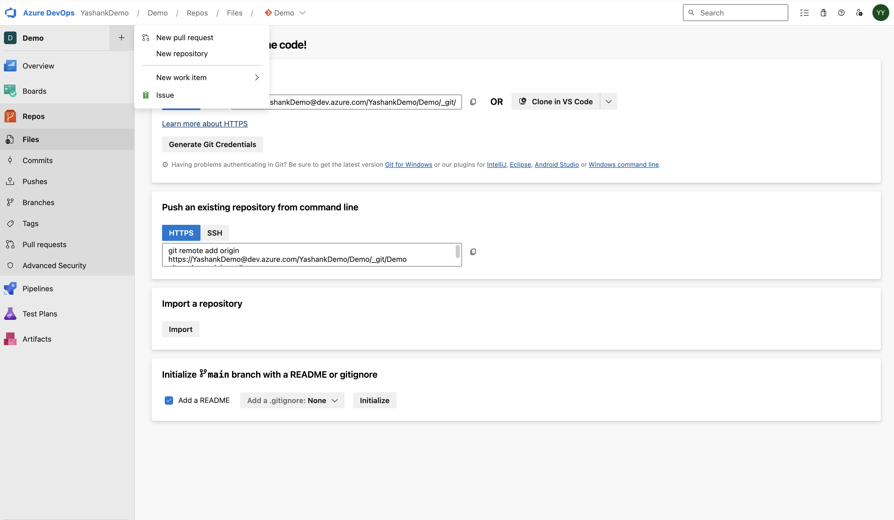
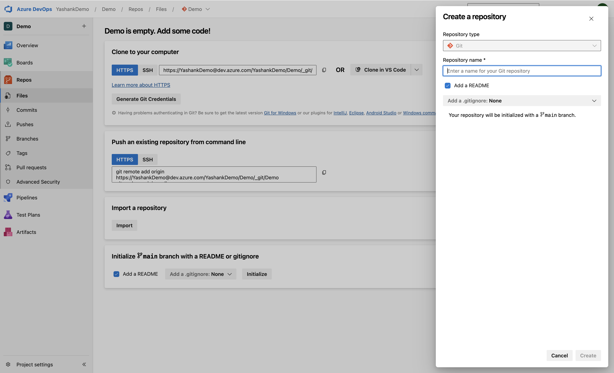
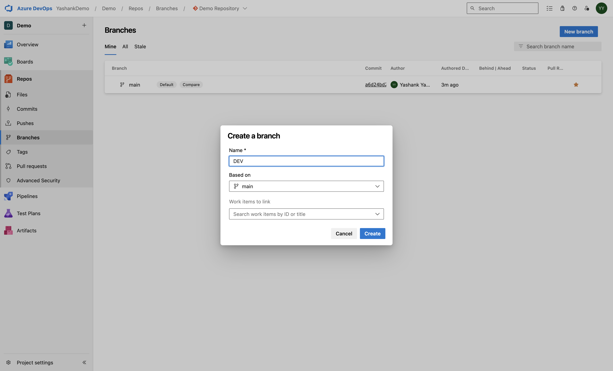
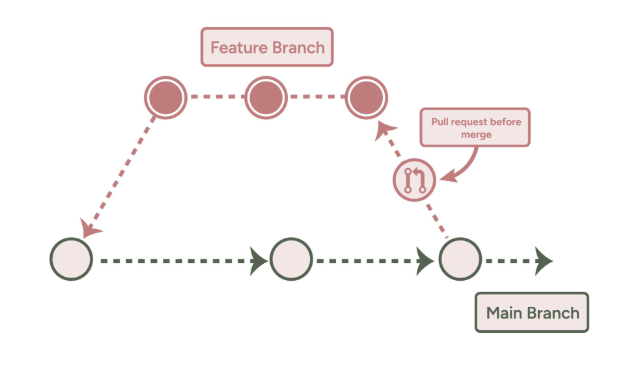

# Version Control with Azure Repos

## Overview

Azure Repos is a version control service provided by Microsoft Azure DevOps. It allows developers to manage their code, collaborate, and maintain version history. In this lesson, we will cover creating repositories, managing branches, and implementing branching strategies with Azure Repos.

Azure DevOps supports the following source control management types:

➤ Git: This is a distributed version control system and is the default version control provider in Azure DevOps when you initialize a new project.

➤ Team Foundation Version Control (TFVC): This is a centralized client-server version control system where developers have only one version of a file locally, data resides on a server, and branches get created on the server.

_NOTE: In this session we are only covering Git_

## Lesson Outcomes

By the end of this lesson, you will be able to:

1. Create and manage repositories in Azure Repos.
2. Understand branching strategies for efficient collaboration.
3. Utilize pull requests for code review and merging.

## Creating Repositories and Managing Branches

### Creating a Repository

To create a Git repository on Azure DevOps, follow these steps:

1. In your project dashboard, click the Repos menu on the left sidebar.

2. From the repository drop-down at the top of the page, click New Repository.

3. In the Create A New Repository dialog, verify that Git is the repository type and enter a name for your new repository.

You can also add a README and create a .gitignore for the type of code in the repository. A README contains details about the code in your repository. The .gitignore file tells Git which kinds of files to ignore, such as temporary build files from your development environment and environment settings

4. Once you have filled out the form, click the Create button, and you will have a new repository.

#### Cloning the Repository
To contribute code to the repository that you have just created, you need to clone it to your local machine. This section covers the steps required to clone an Azure DevOps repository.

1. From your project dashboard, navigate to the Repos dashboard by selecting Repos ➪ Files in the sidebar menu. From here, you can select the repo you’d like to navigate to using the repository drop-down. In the repository, click Clone in the upper-right corner of the files window and copy the clone URL.

2. This is the step that demands you have Git installed on your local machine. Open the terminal, and navigate to the directory where you want the code from the repository to be stored on your local machine. Run git clone followed by the path copied from the clone URL in the previous section.

If you are setting up Git for the first time, you will need to authenticate. Follow the instructions that show up on the pop-up window to authenticate so that you can successfully run Git commands.

Git downloads a copy of the code into a new folder for you to work with. The download includes all commits, branches, and other information from the repository. 

Once you’ve successfully cloned the repository, you can now start making code contributions.

### Managing Branches
Branches allow developers to work on different features or fixes simultaneously without affecting the main codebase.

**Creating a Branch**
1. From your repository, go to the "Branches" section.
2. Click on the "New branch" button.
3. Enter a name for your branch and select the base branch.
4. Click "Create" to create the new branch.

**Merging Branches**
1. From your repository, go to the "Branches" section.
2. Find the branch you want to merge and click on the three dots.
3. Select "Merge" from the dropdown menu.
4. Choose the target branch for the merge and click "Merge" to complete the process.

## Branching Strategies and Pull Requests

### Branching Strategies

**Feature Branching**
- Developers create a new branch for each feature or fix.
- Keep feature branches up-to-date with the main branch.
- Merge feature branches back into the main branch after completion.

**Gitflow**
- Use "develop" and "release" branches alongside feature branches.
- "Develop" branch for ongoing development.
- "Release" branches for preparing and testing releases.

### Pull Requests:

Pull requests allow you to inform your team members that a new implementation has been completed and is ready to be merged into a specified branch. With pull requests, your team members can review your code, add comments about your modifications, and approve or reject those modifications. This is the recommended practice when using source control management with Azure DevOps.

#### Creating a Pull Request:

There are multiple ways to create pull requests in Azure Repos.

➤ You can create a pull request from the Pull Requests page.

➤ You can create a pull request from a feature branch pushed to your repository.

➤ You can also create a pull request from the Development tab in a linked work item in Azure Boards.

#### Creating a Pull Request from the Pull Requests Page:

From the Azure DevOps website, you can create a pull request using the following steps:

1. On the Repos ➪ Pull Requests page, click New Pull Request at the upper right.

2. Select the branch with the changes and the branch you want to merge the changes into. In this example, the branch with the change is called new-feature-branch, while the branch the changes will be merged into is called the main branch.

3. Fill the pull request form and click Create.

#### Creating a Pull Request from a Feature Branch

After you push or update a feature branch, Azure Repos displays a prompt to create a pull request. This prompt is shown on the Repos ➪ Pull Requests page and on the Repos ➪ Files page. Once you click the prompt to create a pull request, you will get redirected to the form to fill in the details for your pull request

### Collaborate in Pull Requests:

Imagine you’re completing a new feature in your software. You have already worked on the feature branch, so the next step is to merge it into the main (or master) branch. To do this, before you merge your code, you should open a pull request so that other team members can review your work and provide feedback.

## Suggested Reading
[Azure Repos Documentation](https://learn.microsoft.com/en-us/azure/devops/repos/git/create-new-repo?view=azure-devops)