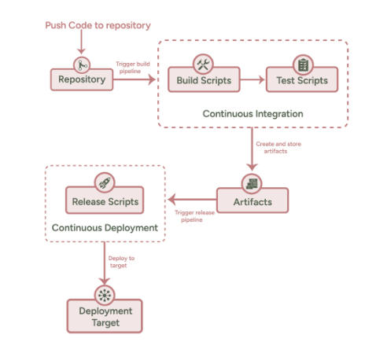

# CI/CD Workflow Basics in Azure Pipelines

## Overview

Azure Pipelines is a service from Microsoft that helps automate building, testing, and release of Software applications. 

In this lesson, we'll cover the basics of CI/CD workflows using Azure Pipelines, compare YAML and Classic pipelines, and discuss pipeline stages, tasks, build, and release pipelines.

## Learning Objectives

By the end of this lesson, you will be able to:

1. Explore the key features of Azure Pipelines.
2. Create and configure a deployment pipeline in Azure DevOps.
3.  Explain the structure and purpose of pipeline stages and tasks.
4. Evaluate the various agent options available in Azure DevOps and their roles in pipeline execution.

## The Lesson

In Azure Pipelines, you can create a build pipeline that tests your source code, and a release pipeline that deploys that source code to the specified target.

### Azure Pipelines Features

Azure Pipelines has a lot of features, and some are listed here:

➤ Pipeline syntax: The steps and actions for CI/CD in your pipeline are defined using YAML. You can also define pipelines using the classic interface.

➤ Programming language agnostic: You can build, test, and release source code written in different programming languages and frameworks.

➤ Operating system agnostic: Azure Pipeline scripts can be run across Linux, Windows, and macOS machines.

➤ Wide range of repositories: You can integrate Azure Pipelines with different repositories such as Azure Repos, GitHub, GitHub Enterprise Server, Bitbucket, Subversion tools, Team Foundation Version Control (TFVC) tools, and other Git repositories.

➤ Cloud provider support: After building and testing your code, you can integrate different cloud providers and deploy your applications.

➤ Versioning: Like code, Azure pipeline runs are versioned. When you run a pipeline on a specified code branch, this can help validate your changes before you merge it to the main source branch

## YAML vs Classic Pipelines

There are two ways to define an Azure pipeline:

➤ The pipeline can be defined by creating a YAML file in your repository with all the steps you’d like to run.

➤ Azure DevOps also has the option for a classic editor. This allows you to select the tasks you’d like to run from a list of available tasks. Here, you do not need to write YAML scripts.

### YAML Pipelines
- Use YAML syntax to define pipelines as code.
- Offer version control and better collaboration.
- Allow for easier automation and scaling.

### Classic Pipelines
- Use a graphical interface to define pipelines.
- Offer a more intuitive experience for beginners.
- Limit customization and automation capabilities.

### Defining Pipelines Using YAML

To create your first Azure pipeline using YAML, follow these simple steps:

1. Visit the Pipelines tab in your project dashboard and click Create Pipeline. That launches a wizard that allows you to set up your pipeline.

2. The next step requires you to connect your pipeline with a repository. Choose the location of the repository that you want to connect with your pipeline (Figure 5.3).

3. After choosing the location, you should select the particular repository you want to connect to.

4.  Once you’ve selected the repository, you will configure your pipeline by creating the tasks that will run. If you don’t have a YAML file, choose the starter pipeline to create one. If you have a YAML file in your repository, select Existing Azure Pipelines YAML File so that you can configure the file to run.

5. If you chose the starter pipeline, you will be redirected to a page with the starter pipeline YAML code.

6. Click the Save And Run button. This will commit the new YAML file to your repository and trigger a pipeline run.

7. If you selected an existing Azure Pipelines YAML file, specify the file path in the pop-up window and click Continue

#### YAML SCHEMA DEFINITION INDEX

- pipeline: The different stages (one or more) that define the entire CI/CD process.

- condition: A job, task, or stage should run only when a specified condition is met.

- jobs: Specifies the jobs that make up the work of a stage. 

- template: A reusable pipeline script. You can define a set of jobs or stages in one file and use it multiple times in another file.

- parameters: The runtime parameters passed to a pipeline.

- pool: Specifies the pool to use for a job in the pipeline. A pool specification also holds information about the job’s strategy for running.

- schedules: Specifies the scheduled triggers for the pipeline.

- stages: Collection of related jobs.

- steps: Linear sequence of operations that make up a job.

- task: Runs the specified task.

- powershell: Runs a script in Windows PowerShell.

- trigger: Specifies which branches cause a continuous integration build to run.

- variables: Defines variables to use in your pipeline.

- variables.group: References variables from a variable group

## Pipeline Stages and Tasks Overview

### Stages
- Logical divisions in a pipeline that represent significant phases, such as build, test, and deploy.
- Can run in parallel or sequentially.
- Can have dependencies on other stages.

### Tasks
- Smallest building blocks of a pipeline.
- Represent individual actions, like running a script or building a project.
- Can be grouped into jobs within a stage.

### Jobs
- Jobs are containers for a set of tasks that run on an agent. They define the environment in which the tasks are executed. A stage can contain one or multiple jobs.

### Agents

At least one agent is required to build and deploy code with Azure Pipelines. Agents are computers that execute the tasks defined in your build or release pipeline.

In Azure Pipelines, there are two types of agents you can define.

➤ _Microsoft-hosted agents_: This is the predefined agent provided by Azure Pipelines. These computers are fully maintained by Microsoft, so all you have to do is use them. You don’t need to worry about upgrades, clearing the virtual machines, or their health. Every time you run a pipeline, a new virtual machine is created for each pipeline job. The virtual machine is terminated after the job finishes running.

➤ _Self-hosted agents_: These are machines that you create and manage by yourself. An agent can be a custom virtual machine in Azure or an on-premise machine that you own. Self-hosted agents can be hosted on Windows, Linux, macOS, or Docker containers. You can install the various software and dependencies required to run your pipeline tasks, and these installed tools will persist for each pipeline execution.

#### Agent Pools

An agent pool is a group of agents. Instead of controlling each agent individually, you categorize them into collections. On configuring an agent, it is registered with the pool, and when you create a pipeline, you define the agent pool in which the pipeline will run. When you run a pipeline, it runs on agents in that pool that match the pipeline’s requirements.

In Azure Pipelines, there are two types of agent pools that are provided by default.

➤ Default agent pools: You can use this type to register the self-hosted agents that you set up to run your pipeline jobs.

➤ Azure Pipelines hosted pool: This agent pool contains different instances of Microsoft-hosted agents running Windows, macOS, and Linux images.

##Suggested Reading
### [Azure Pipelines documentation](https://docs.microsoft.com/en-us/azure/devops/pipelines/?view=azure-devops)
### [YAML pipeline reference](https://docs.microsoft.com/en-us/azure/devops/pipelines/yaml-schema?view=azure-devops&tabs=schema%2Cparameter-schema)
### [Classic pipeline reference](https://docs.microsoft.com/en-us/azure/devops/pipelines/release/?view=azure-devops)

---
## Conculsion 
Understanding CI/CD workflows in Azure Pipelines is essential for efficient and reliable software development. By learning the differences between YAML and Classic pipelines, comprehending pipeline stages and tasks, and understanding build and release pipelines, you can enhance your team's productivity and software quality.

In the next lessons we will see how you can deploy CI and CD piplines with Azure Devops