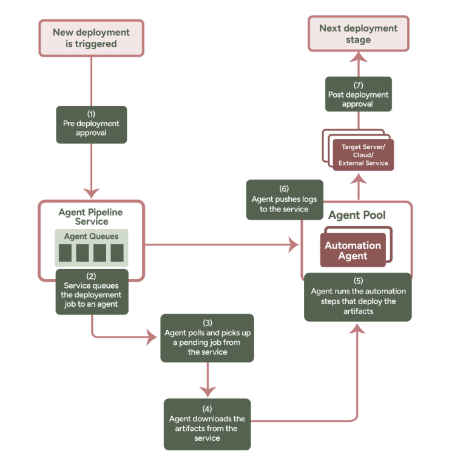
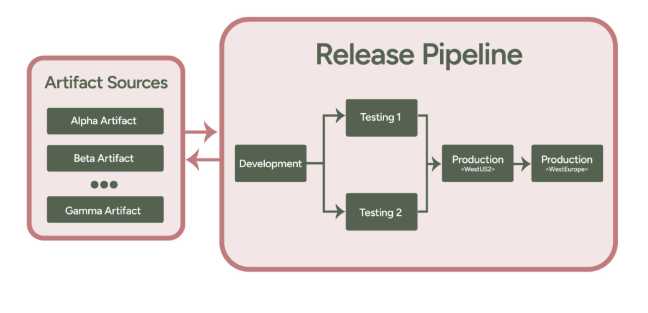

# Lesson: Automating Code Deployment with Azure Pipelines

## Overview

Automating code deployment is a critical aspect of modern DevOps practices, ensuring faster delivery, enhanced reliability, and reduced human intervention. Azure Pipelines provides a powerful platform for implementing continuous integration and continuous deployment (CI/CD), allowing organizations to automate the process of building, testing, and deploying code across various environments. This lesson explores continuous deployment and delivery concepts, the role of release pipelines, and how multistage pipelines enhance deployment workflows.

## Learning Objectives

By the end of this lesson, you will be able to:
1. Understand the concepts of continuous deployment and continuous delivery.
2. Recognize the advantages of automating code deployments.
3. Explain the components and functionality of Azure release pipelines.
4. Describe the purpose and workflow of multistage pipelines in Azure.
5. Implement effective deployment practices using Azure Pipelines.

## Continuous Deployment

### What Is Continuous Deployment?
Continuous deployment automates the release of code updates directly into production environments. It relies on a series of automated tests to ensure that only high-quality code is deployed. Once code passes these predefined tests, it is automatically pushed to production without manual approval.

#### Benefits of Continuous Deployment:
1. **Faster Releases:** Code changes are deployed immediately after passing automated tests, enabling quicker delivery of features to customers.
2. **Smaller, Incremental Updates:** Frequent and smaller updates reduce the risk of failure and make troubleshooting easier.
3. **Reduced Manual Effort:** Automation eliminates repetitive manual tasks, allowing developers to focus on writing and improving code.
4. **Faster Customer Feedback:** Frequent updates allow quicker assessment of user engagement and behavior, helping teams pivot strategies if needed.

### Tools for Continuous Deployment:
1. **Secrets Management:** Ensures secure access to credentials without exposing them in plain text during deployments.
2. **Configuration Management:** Maintains consistent infrastructure and application configurations.
3. **Rollback Tools:** Enables quick recovery in case of deployment issues.
4. **Release Automation:** Automates deployment tasks to ensure efficient rollouts.
5. **Monitoring Tools:** Tracks application performance and identifies issues post-deployment.

## Continuous Delivery

### What Is Continuous Delivery?
Continuous delivery ensures that application builds are automatically deployed to a testing environment after passing quality assurance checks. Unlike continuous deployment, it requires manual approval before deploying to production. 

#### Benefits of Continuous Delivery:
1. **Faster Integration:** Automating builds, deployments, and testing shortens the development cycle.
2. **Low-Risk Deployments:** Practices like blue-green deployments minimize downtime and risks during updates.
3. **Improved Quality:** Rigorous testing in quality assurance environments ensures customers receive stable and reliable products.

## Release Pipelines in Azure

### What Are Release Pipelines?
Release pipelines define the automated and manual steps needed to validate, package, and deploy code changes to various environments. They streamline the deployment process, ensuring efficiency and consistency.

#### Key Steps in Azure Release Pipelines:
1. **Predeployment Approval:** Verifies if approval is required before initiating a deployment.
2. **Queue Deployment Job:** Schedules deployment on an available agent.
3. **Agent Selection:** Assigns a deployment agent to execute the job.
4. **Download Artifacts:** Fetches the necessary build artifacts from the repository.
5. **Execute Deployment:** Performs deployment tasks.
6. **Logging:** Generates detailed logs for each deployment stage.
7. **Postdeployment Approval:** Determines if further approval is required before progressing to the next stage.

### Benefits of Release Pipelines:
1. **Accelerated Releases:** Automates repetitive tasks to reduce release times.
2. **Increased Developer Productivity:** Frees developers from deployment-related tasks, allowing them to focus on coding.
3. **Enhanced Stability:** Includes fail-safes and rollback mechanisms to handle deployment issues.

## Multistage Pipelines

### What Are Multistage Pipelines?
Multistage pipelines deploy applications across multiple environments, such as test, staging, and production. This ensures thorough validation at each stage before progressing to the next.

#### Typical Environments in Multistage Pipelines:
1. **Test Environment:** Allows QA teams to test code changes using automated or manual methods.
2. **Staging Environment:** Replicates the production environment to validate performance and functionality before deployment.
3. **Production Environment:** The live environment where the application is accessible to end-users.

### How Multistage Pipelines Work:
1. The pipeline deploys the application to the test environment.
2. If successful, it triggers deployment to the staging environment.
3. After validation in staging, the application is deployed to production.
4. If any stage fails, logs indicate the error, and the pipeline halts. Teams can then resolve the issue before retrying the deployment.

#### Advantages of Multistage Pipelines:
1. **Thorough Validation:** Ensures every update undergoes rigorous testing before reaching production.
2. **Improved Reliability:** Minimizes the risk of deploying unstable updates to production.
3. **Streamlined Debugging:** Logs from failed stages provide clear insights for troubleshooting.

## Suggested Reading
1. [Azure Pipelines Documentation](https://learn.microsoft.com/en-us/azure/devops/pipelines/)
2. [Best Practices for CI/CD with Azure Pipelines](https://learn.microsoft.com/en-us/azure/devops/learn/devops-at-microsoft/use-azure-pipelines)
3. [Continuous Delivery vs. Continuous Deployment](https://www.redhat.com/en/topics/devops/ci-cd)
